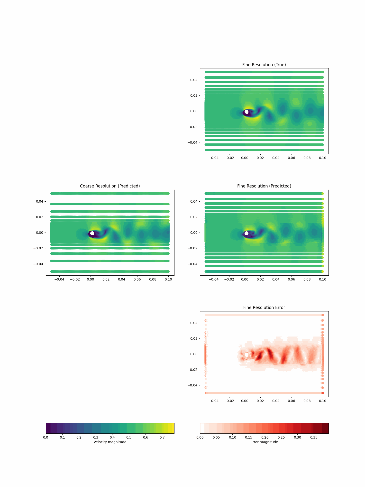

# TransferLearning

1. Multiscale Training
Training with low + high resolution results, test can provide high resolution results with low resolution guideness

<table>
  <tr>
    <th>Multi-scale learning from different mesh resolutions</th>
  </tr>
  <tr>
    <td></td>
  </tr>
</table>
